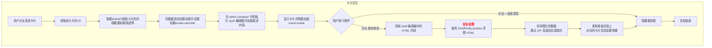

```mermaid
graph TD
subgraph 卡片交互
A[用户点击某张卡片] --> B[获取该卡片的 ID];
B --> C[根据ID从API获取卡片的详细数据标题描述等];
C --> D[将数据填充到模态框中设置标题modal-card-title];
D --> E[在 editor-container 中初始化 Quill 编辑器并加载描述内容];
E --> F[显示卡片详情模态框<br>#card-modal];
F --> G{用户进行操作};
G -- 点击 保存按钮 --> H[获取 Quill 编辑器中的 HTML 内容];
G -- 点击 × 或遮罩层 --> L[隐藏模态框];
H --> I[<font color=red><b>安全处理</b></font><br>使用 DOMPurify.sanitize 清理 HTML];
I --> J[将清理后的数据<br>通过 API 发送到后端保存];
J --> K[更新看板页面上<br>对应的卡片信息如果需要];
K --> L;
L --> M[流程结束];
end
```
